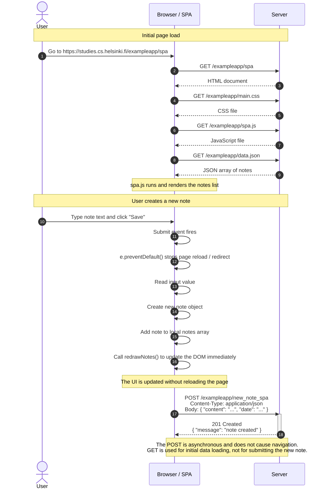

```mermaid
sequenceDiagram
    autonumber
    actor User as User
    participant Browser as Browser / SPA
    participant Server as Server

    Note over User,Server: Initial page load

    User->>Browser: Go to https://studies.cs.helsinki.fi/exampleapp/spa
    Browser->>Server: GET /exampleapp/spa
    Server-->>Browser: HTML document
    Browser->>Server: GET /exampleapp/main.css
    Server-->>Browser: CSS file
    Browser->>Server: GET /exampleapp/spa.js
    Server-->>Browser: JavaScript file
    Browser->>Server: GET /exampleapp/data.json
    Server-->>Browser: JSON array of notes

    Note over Browser: spa.js runs and renders the notes list

    Note over User,Server: User creates a new note

    User->>Browser: Type note text and click "Save"
    Browser->>Browser: Submit event fires
    Browser->>Browser: e.preventDefault() stops page reload / redirect
    Browser->>Browser: Read input value
    Browser->>Browser: Create new note object
    Browser->>Browser: Add note to local notes array
    Browser->>Browser: Call redrawNotes() to update the DOM immediately

    Note over Browser: The UI is updated without reloading the page

    Browser->>Server: POST /exampleapp/new_note_spa<br/>Content-Type: application/json<br/>Body: { "content": "...", "date": "..." }
    activate Server
    Server-->>Browser: 201 Created<br/>{ "message": "note created" }
    deactivate Server

    Note over Browser,Server: The POST is asynchronous and does not cause navigation.<br/>GET is used for initial data loading, not for submitting the new note.
```
